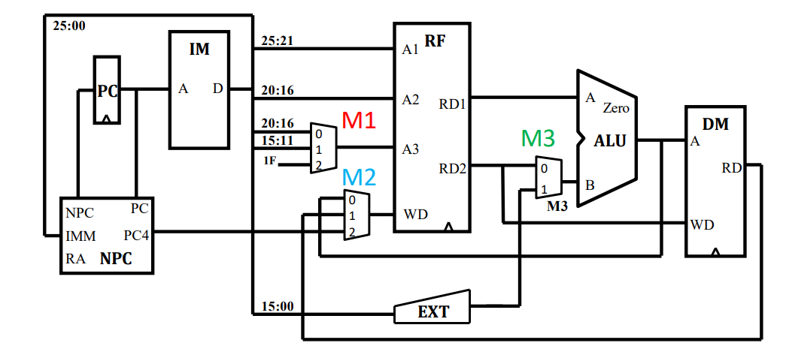

#设计草稿
##一、数据通路
 
###PC
同步复位，按字节寻址
起始地址：0x00003000
地址范围：0x00003000 ~ 0x00006FFF

###IM
容量为 16KiB（4096 × 32bit）
起始地址从0开始，按字寻址

###Controller
控制器，具体见控制器设计

###PCcounter
根据PC和PCSrc计算NPC

###GRF
具有写使能
具有同步复位功能
寄存器总数为 32
0 号寄存器的值始终保持为 0
其他寄存器初始值（复位后）均为 0

###ALU
提供 32 位与、或、加、减、lui的加载至高位与大小比较功能
加减法按无符号处理（不考虑溢出）

###DM
容量为 12KiB（3072 × 32bit）（实现过程中开了8192）
同步复位
起始地址：0x00000000
地址范围：0x00000000 ~ 0x00002FFF

###Ext
对立即数进行有符号扩展与无符号扩展

###mips
顶层对模块进行连接

##二、控制器设计


| 控制信号 | 失效时作用（0） | 有效时作用（1） |
| :-- | :-- | :--  |
| RegDst[1:0] | GRF写入端地址选择Rt字段 | GRF写入端地址选择Rd字段 |
| RegDst[1:0] | GRF写入端地址选择GPR[31] | 无 |
| ALUSrc | ALU输入端B选择GRF输出R[rt] | ALU输入端B选择Ext_ext输出 |
| MemtoReg[1:0] | 00:GRF写入端数据来自ALU输出 | 01:GRF写入端数据来自DM输出 |
| MemtoReg[1:0] | 10:GRF写入端数据来自pc4输出 | 无 |
| RegWrite | 无 | 把数据写入GRF中对应寄存器 |
| MemWrite | 无 | 数据存储器DM写数据（输入） |
| PCSrc[1:0] | 00:PC输入端选择PC+4 | 01:if(Zero),PC输入端选择beq指令的目的地址 |
| PCSrc[1:0] | 10:PC输入端选择jal指令的目的地址 | 11:PC输入端选择jr指令的目的地址 |
| ExtOp | sign_ext | zero_ext | 
| ALUOp[2:0] | 000:与 | 001:或 |
| ALUOp[2:0] | 010:加法 | 011:减法 |
| ALUOp[2:0] | 100:lui加载至高位 | 无 |

| Op | 000000 | 000000 | 001101 | 100011 | 101011| 000100 | 001111 | 000011 | 000000 | 
| :-- | :-- | :-- | :-- | :-- | :-- | :-- | :-- | :-- | :-- |
| Func | 100000 | 100010 | 无 | 无 | 无 | 无 | 无 | 无 | 001000 |
| | add | sub | ori | lw | sw | beq | lui | jal | jr |
| RegDst[1:0] | 01 | 01 | 00 | 00 | x | x | 00 | 10 | x |
| ALUSrc | 0 | 0 | 1 | 1 | 1 | 0 | 1 | x | x |
| MemtoReg[1:0] | 00 | 00 | 00 | 01 | x | x | 00 | 10 | x |
| RegWrite | 1 | 1 | 1 | 1 | 0 | 0 | 1 | 1 | x |
| MemWrite | 0 | 0 | 0 | 0 | 1 | 0 | 0 | 0 | 0 |
| PCSrc[1:0] | 00 | 00 | 00 | 00 | 00 | 01 | 00 | 10 | 11 |
| ExtOp | x | x | 1 | 0 | 0 | 0 | x | x | x |
| ALUOp[2:0] | 010 | 011 | 001 | 010 | 010 | 011 | 100 | x | x |

##三、测试方案
采用一个递归算斐波那契数列第七项数的测试，覆盖所有指令
```
0x0000000000000000:  34 10 00 04    ori $s0, $zero, 4
0x0000000000000004:  34 12 00 01    ori $s2, $zero, 1
0x0000000000000008:  34 13 00 02    ori $s3, $zero, 2
0x000000000000000c:  34 1D 2F FC    ori $sp, $zero, 0x2ffc
0x0000000000000010:  36 31 00 07    ori $s1, $s1, 7
0x0000000000000014:  00 11 28 20    add $a1, $zero, $s1
0x0000000000000018:  0C 00 0C 09    jal 0x3024
0x000000000000001c:  00 60 20 20    add $a0, $v1, $zero
0x0000000000000020:  0C 00 0C 28    jal 0x30a0
0x0000000000000024:  AF BF 00 00    sw  $ra, ($sp)
0x0000000000000028:  03 B0 E8 22    sub $sp, $sp, $s0
0x000000000000002c:  AF A5 00 00    sw  $a1, ($sp)
0x0000000000000030:  03 B0 E8 22    sub $sp, $sp, $s0
0x0000000000000034:  AF A8 00 00    sw  $t0, ($sp)
0x0000000000000038:  03 B0 E8 22    sub $sp, $sp, $s0
0x000000000000003c:  34 08 00 00    ori $t0, $zero, 0
0x0000000000000040:  10 B2 00 0F    beq $a1, $s2, 0x80
0x0000000000000044:  10 B3 00 0E    beq $a1, $s3, 0x80
0x0000000000000048:  00 B2 28 22    sub $a1, $a1, $s2
0x000000000000004c:  0C 00 0C 09    jal 0x3024
0x0000000000000050:  00 68 40 20    add $t0, $v1, $t0
0x0000000000000054:  00 B2 28 22    sub $a1, $a1, $s2
0x0000000000000058:  0C 00 0C 09    jal 0x3024
0x000000000000005c:  00 68 40 20    add $t0, $v1, $t0
0x0000000000000060:  35 03 00 00    ori $v1, $t0, 0
0x0000000000000064:  03 B0 E8 20    add $sp, $sp, $s0
0x0000000000000068:  8F A8 00 00    lw  $t0, ($sp)
0x000000000000006c:  03 B0 E8 20    add $sp, $sp, $s0
0x0000000000000070:  8F A5 00 00    lw  $a1, ($sp)
0x0000000000000074:  03 B0 E8 20    add $sp, $sp, $s0
0x0000000000000078:  8F BF 00 00    lw  $ra, ($sp)
0x000000000000007c:  03 E0 00 08    jr  $ra
0x0000000000000080:  34 03 00 01    ori $v1, $zero, 1
0x0000000000000084:  03 B0 E8 20    add $sp, $sp, $s0
0x0000000000000088:  8F A8 00 00    lw  $t0, ($sp)
0x000000000000008c:  03 B0 E8 20    add $sp, $sp, $s0
0x0000000000000090:  8F A5 00 00    lw  $a1, ($sp)
0x0000000000000094:  03 B0 E8 20    add $sp, $sp, $s0
0x0000000000000098:  8F BF 00 00    lw  $ra, ($sp)
0x000000000000009c:  03 E0 00 08    jr  $ra
0x00000000000000a0:  34 04 00 07    ori $a0, $zero, 7
```
MIPS
```
34100004
34120001
34130002
341d2ffc
36310007
00112820
0c000c09
00602020
0c000c28
afbf0000
03b0e822
afa50000
03b0e822
afa80000
03b0e822
34080000
10b2000f
10b3000e
00b22822
0c000c09
00684020
00b22822
0c000c09
00684020
35030000
03b0e820
8fa80000
03b0e820
8fa50000
03b0e820
8fbf0000
03e00008
34030001
03b0e820
8fa80000
03b0e820
8fa50000
03b0e820
8fbf0000
03e00008
34040007
```

##四、思考题
#####1、阅读下面给出的 DM 的输入示例中（示例 DM 容量为 4KB，即 32bit × 1024字），根据你的理解回答，这个 addr 信号又是从哪里来的？地址信号 addr 位数为什么是 [11:2] 而不是 [9:0] ？
  
在指令sw、lw中，DMaddr来源于ALU对寄存器值和偏移量计算的结果，因此来源于ALUout。因为DM的是按字寻址，PC是按字节寻址，lw和sw的地址为4的整数倍，故取前10位。

#####2、思考上述两种控制器设计的译码方式，给出代码示例，并尝试对比各方式的优劣。

指令对应的控制信号如何取值
```
if (Instr[m:n] == xxx) begin
    signal_1 = aaa;
end 
else if (Instr[m:n] == yyy) begin
    signal_2 = bbb;
end
```
控制信号每种取值所对应的指令
```
assign sig1 = ((ins == xxx1) || (ins == xxx2)) ? 1 : 0;
```
第一种：添加指令比较方便，代码比较复杂
第二种：代码短，但不利于修改

我所使用的：借鉴logisim中的与或逻辑，引入add,sub……中间变量

#####3、在相应的部件中，复位信号的设计都是同步复位，这与 P3 中的设计要求不同。请对比同步复位与异步复位这两种方式的 reset 信号与 clk 信号优先级的关系。

同步复位：clk优先
异步复位：reset优先

#####4、 语言是一种弱类型程序设计语言。C 语言中不对计算结果溢出进行处理，这意味着 C 语言要求程序员必须很清楚计算结果是否会导致溢出。因此，如果仅仅支持 C 语言，MIPS 指令的所有计算指令均可以忽略溢出。 请说明为什么在忽略溢出的前提下，addi 与 addiu 是等价的，add 与 addu 是等价的。提示：阅读《MIPS32® Architecture For Programmers Volume II: The MIPS32® Instruction Set》中相关指令的 Operation 部分。

如果忽略溢出，即不需要判断是否溢出，那么add和addu都只需将计算结果保存即可，不需要触发相关异常，因此等价。
