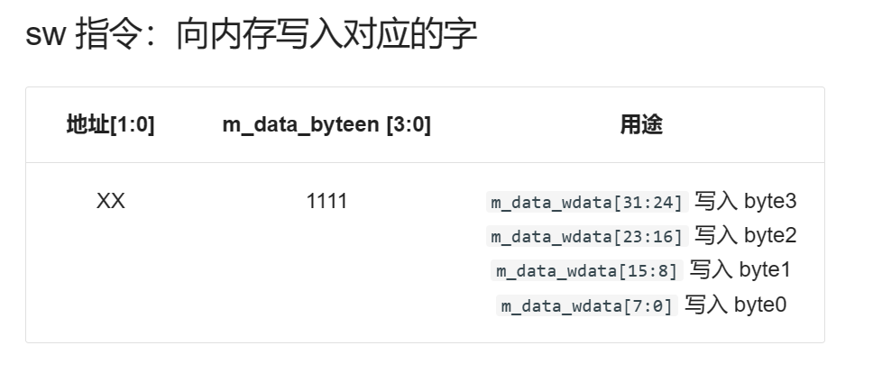
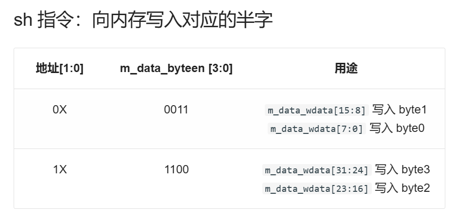
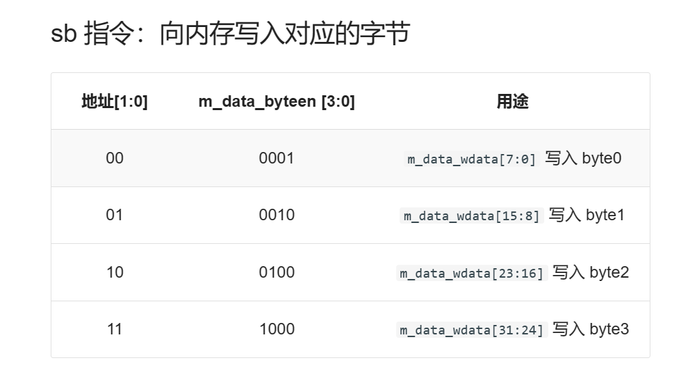

####模块接口
| 信号名 | 方向 | 描述 |
| :-- | :-- | :-- |
| clk | I | 时钟信号 |
| reset | I | 同步复位信号 |
| i_inst_rdata [31:0] | I | i_inst_addr 对应的 32 位指令 |
| m_data_rdata [31:0] | I | m_data_addr 对应的 32 位数据 |
| i_inst_addr [31:0] | O | 需要进行取指操作的流水级 PC（一般为 F 级） |
| m_data_addr [31:0] | O | 数据存储器待写入地址 |
| m_data_wdata [31:0] | O | 数据存储器待写入数据 |
| m_data_byteen [3:0] | O | 字节使能信号 |
| m_inst_addr [31:0] | O | M 级 PC |
| w_grf_we | O | GRF 写使能信号 |
| w_grf_addr [4:0] | O | GRF 中待写入寄存器编号 |
| w_grf_wdata [31:0] | O | GRF 中待写入数据 |
| w_inst_addr [31:0] | O | W 级 PC |
####数据通路
五级流水线
| 阶段 | 简称 | 功能概述 |
| :-- | :-- | :-- |
| 取指阶段（Fetch） | F | 从指令存储器中读取指令 |
| 译码阶段（Decode） | D | 从寄存器文件中读取源操作数并对指令译码以便得到控制信号 |
| 执行阶段（Execute） | E | 使用 ALU 执行计算 |
| 存储阶段（Memory）	 | M | 读或写数据存储器 |
| 写回阶段（Writeback） | W | 将结果写回到寄存器文件 |

T~use~：表示数据到了 D 级之后还需要多少个周期要使用，每个指令的T~use~是固定不变的（指令进入IF/ID寄存器后，其后的某个功能部件再经过多少cycle就必须要使用相应的寄存器值）
T~new~：表示数据还有多长时间产生，会随着数据的流水动态减少（位于ID/EX及其后各流水线的指令，再经过多少个时钟周期，能够产生要写入寄存器的结果）
会产生结果的指令：cal_r类，cal_i类，ld类———可充当供给方，考察其T~new~

###测试方案
文本文档

###思考题
#####1、为什么需要有单独的乘除法部件而不是整合进 ALU？为何需要有独立的 HI、LO 寄存器？

如果乘除法部件在ALU中，那么在乘除运算延迟的过程中，其他指令因为无法使用ALU而无法继续执行。而单独的乘除法部件可以保证在运算延迟的过程中，其他无关指令仍然可以正常访问ALU并执行，提高执行速度。hi和lo是与乘法运算器相关的两个寄存器，的用来存放结果的地方。它们并不是通用寄存器,除了用在乘除法之外,也不没有其他用途。由高内聚、低耦合的原则，我们需要将他们独立。

#####2、真实的流水线 CPU 是如何使用实现乘除法的？请查阅相关资料进行简单说明。

首先CPU会初始化三个通用寄存器用来存放被乘数，乘数，部分积的二进制数，部分积寄存器初始化为0!然后在判断乘数寄存器的低位是低电平还是高电平 (0/1)!如果为0则将乘数寄存器右移一位，同时将部分积寄存器也右移一位，在位移时遵循计算机位移规则，乘数寄存器低位溢出的一位丢弃，部分积寄存器低位溢出的一位填充到乘数寄存器的高位，同时部分积寄存器高位补01
如果为1则将部分积寄存器加上被乘数寄存器，在进移位操作。
当所有乘数位处理完成后部分积寄存器做高位乘数寄存器做低位就是最终乘法结果!

首先CPU会初始化三个寄存器,用来存放被除数，除数，部分商!余数(被除数与除数比较的结果)放到被除数的
有效高位上!CPU做除法时和做除法时是相反的，乘法是右移，除法是左移，乘法做的是加法，除法做的是减法首先CPU会把被除数bit位与除数bit位对齐，然后在让对齐的被除数与除数比较(双符号位判断)。这里说一下什么是双符号位判断:
比如01-10=11(前面的1是符号位) 1-2=-1 计算机通过符号位和后一位的bit位来判断大于和小于，那么01-10=11就说明01小于10，如果得数为01就代表大于，如果得数为00代表等于。如果得数大于或等于则将比较的结果放到被除数的有效高位上然后在商寄存器上商:1 并向后多看一位上商就是将商的最低位左移1位腾出商寄存器最低位上新的商)如果得数小于则上商: 0 并向后多看一位
然后循环做以上操作当所有的被除数都处理完后，商做结果被除数里面的值就是余数!

#####3、请结合自己的实现分析，你是如何处理 Busy 信号带来的周期阻塞的？

clk上升沿且Start下对应指令解析给cnt赋值
Busy = (cnt != 0);

#####4、请问采用字节使能信号的方式处理写指令有什么好处？（提示：从清晰性、统一性等角度考虑）

四位字节使能对应4种store类方式，清晰明了。每一种指令（字节、半字、字）根据需要分别对使能信号不同位置1，具有统一性。

#####5、请思考，我们在按字节读和按字节写时，实际从 DM 获得的数据和向 DM 写入的数据是否是一字节？在什么情况下我们按字节读和按字节写的效率会高于按字读和按字写呢？

不是，是一字32bits
不用移位时

#####6、为了对抗复杂性你采取了哪些抽象和规范手段？这些手段在译码和处理数据冲突的时候有什么样的特点与帮助？

分布式译码 对指令进行分类 可扩展性高

#####7、在本实验中你遇到了哪些不同指令类型组合产生的冲突？你又是如何解决的？相应的测试样例是什么样的？

stall表和转发表

#####8、如果你是手动构造的样例，请说明构造策略，说明你的测试程序如何保证覆盖了所有需要测试的情况；如果你是完全随机生成的测试样例，请思考完全随机的测试程序有何不足之处；如果你在生成测试样例时采用了特殊的策略，比如构造连续数据冒险序列，请你描述一下你使用的策略如何结合了随机性达到强测的效果。

自动生成数据（数据生成器）

